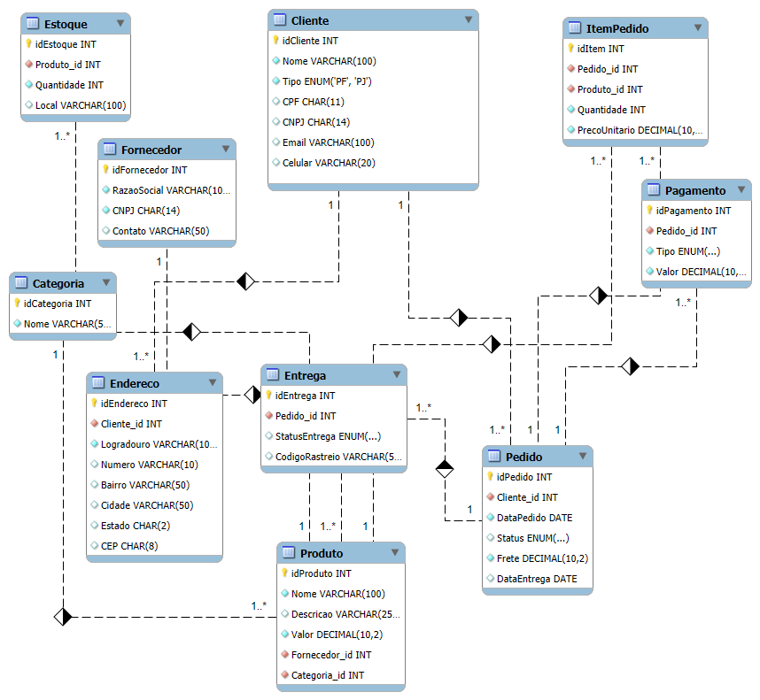

# DIO_SQLtest
Modelo de banco de dados para e-commerce com clientes PF/PJ, pedidos, pagamentos e entregas.

# 📦 Projeto E-commerce – Banco de Dados Relacional

## 📝 Descrição do Projeto
Este projeto foi desenvolvido como parte de um desafio para modelagem de banco de dados de um sistema de e-commerce.  
O objetivo foi criar um **modelo conceitual e lógico** que atenda aos principais requisitos de um ambiente de vendas online, garantindo a consistência e integridade dos dados.

---

## ✅ **Objetivos do Desafio**
- Permitir cadastro de clientes **Pessoa Física (PF)** ou **Pessoa Jurídica (PJ)**, mas nunca ambos para a mesma conta.
- Cada **pedido** pode ter **uma ou mais formas de pagamento**.
- Implementar uma estrutura de **entrega**, contendo **status** e **código de rastreio**.
- Manter entidades para controle de **estoque, categorias, fornecedores** e demais aspectos do negócio.

---

## 📐 **Modelo Conceitual**
O modelo contempla as seguintes entidades:

- **Cliente**: Contém informações pessoais, incluindo CPF para PF e CNPJ para PJ.
- **Endereço**: Relacionado ao cliente, possibilitando múltiplos endereços.
- **Pedido**: Associado ao cliente, com informações sobre data, status e frete.
- **ItemPedido**: Detalha os produtos de cada pedido, com quantidade e preço unitário.
- **Pagamento**: Permite múltiplas formas para um mesmo pedido.
- **Entrega**: Vinculada ao pedido, com status e código de rastreio.
- **Produto**: Armazena dados dos itens disponíveis, vinculados a categorias e fornecedores.
- **Estoque**: Controla a quantidade e localização dos produtos.
- **Categoria**: Classificação dos produtos.
- **Fornecedor**: Dados sobre quem fornece os produtos.

---

## 🔗 **Diagrama do Banco**

